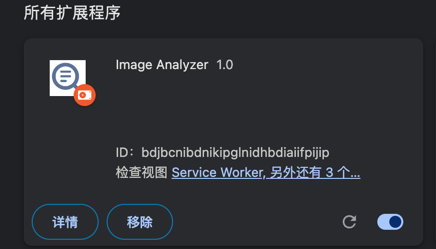

### LLM + OCR


* 后面可以扩展插件支持一些奇怪的表格处理数据，也可以使用`openai`的模型，目前是做了一个POC验证。
* 主要是为了方便识别一些简单的小图片，比如有些图片上的文字等消息，需要整理出来或是复制等，也能识别一些不清晰的内容。


#### Quick Start

* PP-OCR-V4.0
* Ollama (`gemma2:2b-instruct-q8_0`)
* flask
* chrome plugin


```shell

pip install -r requirements.txt
python app.py

```


### install chrome plugin
* open `chrome://extensions/`
* switch developer mode on
* load unpacked extension



* find image and right click to open with WiseRead（`Analyze Image`）


*  Result for Chrome Tab will be shown as below on right div box


### Model 

* llama3.1:8b-instruct-q8_0 `效果最好`
* gemma2:9b-instruct-q8_0
* Qwen1.5-MoE-A2.7B-Chat:latest


### TODO

* 优化提示词(Doing...)
* 使用RAG优化结果，使结果更稳定(Doing...)